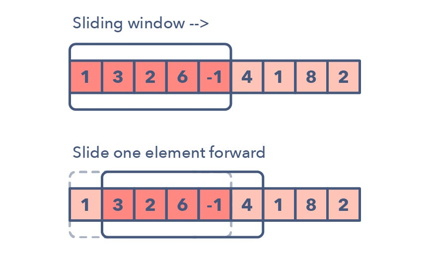
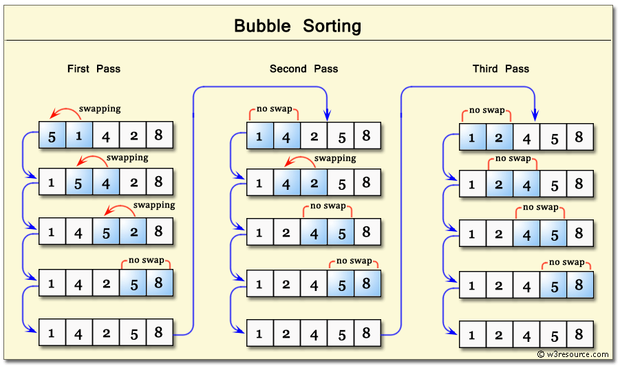

## Two Pointers 

Check if string is Palindrome, using two pointers.
Two pointers are used to check both ends of the string/array
```python
def two_pointers(array):

    start = 0
    end = len(array) - 1

    while start <= end:

        if array[start] != array[end]:
            return False

        start += 1
        end -= 1
    return True
```

Leetcode problems:
- https://leetcode.com/problems/reverse-string/
- https://leetcode.com/problems/valid-palindrome/
- https://leetcode.com/problems/merge-sorted-array/ *
- https://leetcode.com/problems/two-sum-ii-input-array-is-sorted/ *
- https://leetcode.com/problems/3sum/ *


## Binary Search 
Binary Search is defined as a searching algorithm used in a sorted array by repeatedly dividing the search interval in half. The idea of binary search is to use the information that the array is sorted and reduce the time complexity to O(log N). 


```python
def binary_search(array, target):
    # if target in nums:
    #     return nums.index(target)
    # return -1
    ############ Bruteforce
    # count = 0

    # while count < len(nums):
    #     if nums[count] == target:
    #         return count
    #     count += 1

    # return -1
    ############ Binary
    left = 0
    right = len(array) - 1

    while left <= right:
        mid = (left + right) // 2

        if array[mid] == target:
            return mid
        elif array[mid] < target:
            left = mid + 1
        else:
            right = mid - 1
    return -1
```

Leetcode problems:
- https://leetcode.com/problems/binary-search/
- https://leetcode.com/problems/search-a-2d-matrix/ *
- https://leetcode.com/problems/find-minimum-in-rotated-sorted-array/
- https://leetcode.com/problems/search-in-rotated-sorted-array/
- https://leetcode.com/problems/time-based-key-value-store/


## Sliding Window
Sliding window typically consists of two pointers, often denoted as left and right, that define the boundaries of the current window. These pointers are adjusted as the window slides through the array or string to solve the problem at hand.



```python
def sliding_window(array):
        # count = 0
        # for i in range(len(s)-2):
        #     if len(set(s[i:i+3])) == 3:
        #         count+=1
        # return count

        ###########
        count = 0
        start = 0
        end = 3

        while end <= len(s):
            if len(set(s[start:end])) == 3:
                count += 1
                print(s[start:end])
            
            start += 1
            end += 1

        return count 

```

Leetcode problems:
- https://leetcode.com/problems/best-time-to-buy-and-sell-stock/ *
- https://leetcode.com/problems/substrings-of-size-three-with-distinct-characters/
- https://leetcode.com/problems/longest-substring-without-repeating-characters/
- https://leetcode.com/problems/longest-repeating-character-replacement/
- https://leetcode.com/problems/permutation-in-string/
- https://leetcode.com/problems/minimum-window-substring/
- https://leetcode.com/problems/sliding-window-maximum/


## Fast+Slow Pointers 

Leetcode problems:
- https://leetcode.com/problems/linked-list-cycle/

## Merging Intervals 

Merging Intervals involves merging overlapping or intersecting intervals in a collection of intervals. Each interval is typically represented as a pair of values: a start point and an end point. The goal is to combine overlapping intervals into a single interval, resulting in a consolidated set of non-overlapping intervals.

```python
def merge(self, intervals: List[List[int]]) -> List[List[int]]:

    if not intervals:
        return []

    intervals.sort(key=lambda x: x[0])
    merged_intervals = [intervals[0]]

    for interval in intervals[1:]:
        if interval[0] <= merged_intervals[-1][1]: 
            merged_intervals[-1][1] = max(merged_intervals[-1][1], interval[1]) 
        else:
            merged_intervals.append(interval)

    return merged_intervals
```

Leetcode problems:
- https://leetcode.com/problems/merge-intervals/

## Sorting 

## Linked List Reversal 

## BFS 

## Recursion 

## DFS 

## Topological Sort 

## Memoization 

## DP

## Bubble Sort

Bubble Sort is a simple sorting algorithm that repeatedly steps through the list to be sorted, compares adjacent elements, and swaps them if they are in the wrong order. This process is repeated for each element in the list until the entire list is sorted. The algorithm gets its name from the way smaller elements "bubble" to the top of the list in each pass.



```python
def bubble_sort(arr):
    arr_length = len(arr)
    
    for i in range(arr_length):
        for j in range(0, arr_length-i-1):
            if arr[j] > arr[j+1]:
                arr[j], arr[j+1] = arr[j+1], arr[j]

arr = [64, 34, 25, 12, 22, 11, 90]
bubble_sort(arr)
print("Sorted array:", arr) # [11, 12, 22, 25, 34, 64, 90]
```

## Quick Sort

## Merge Sort

## Insertion Sort

## Selection Sort
